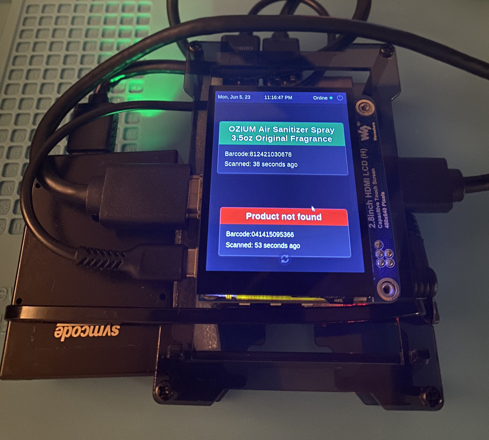

# TrashScan _The Device_&trade;

## Screenshot



## Table of Contents

- [Description](#descritption)
- [Installation](#installation-instructions)
- [Service Configuration](#service-configuration)

## Descritption

TrashScan _The Device_&trade; is the smart barcode scanner that powers [TrashScan _The App&trade;_](https://github.com/iiTONELOC/trashscan-app). The Device, not only adds scanned barcodes to the user's default list, but it provides instant feedback regarding product information. The barocdes are translated into product data via a GraphQL API call made to the LandFill&trade;; which is the API that powers the App, provides unstructured data storage via MongoDB, and authentication via JWT for its users. While an example of installation is provided below, it is important to point out that the application will not work unless you are an authorized user of TrashScan _The App_&trade; and have a symcode usb barcode scanner.

> **_`Limitations`_**:
>
> This is a purpose built device targeting Ubuntu but should work pretty much the same with most Debian distributions of Linux.  
> The project as it currently sits will not work with Windows or Mac as the platform specific commands target the end device and not all platforms.
> This should be the only real hinderance and could be changed if absolutely necessary.

## Installation Instructions

1. Ensure you are up to date:

   ```bash
   sudo apt update && sudo apt upgrade
   ```

2. The GUI requires Node.js and NPM, if you already have both installed and updated to LTS then you can skip this step. The project has currently been tested to work on versions 18.16.0 and 19.9.0. There was a build failure in Parcel when trying 20.2.0. There are many ways to install node, I foud the easiest was to install it via NVM or Node Version Manager and then install NPM globally via apt.

   [Follow the instructions here to install node via NVM](https://www.linode.com/docs/guides/how-to-install-use-node-version-manager-nvm/#install-nvm).

3. Install NPM via apt:

   ```bash
   sudo apt install npm
   ```

4. Install Python Dependecies. Python2 and 3 should be installed automatically but the following may still be needed to eliminate build errors.

   ```bash
   # pthon3.10-venv to create virtual environments via python not pip
   sudo apt install python3.10-venv


   # Optional, was required for a sucessful build on the Odroid running Ubuntu MATE.
   # You can skip this step and see if it builds sucessfully. On Failure, install these and try again:

   # install necessary compliers
   sudo apt install built-essential

   # python dev, header files for the C API
   sudo apt install python3-dev

   # evdev, needed for acces to /dev/input
   pip install evdev
   ```

5. Open a terminal, navigate to where you want the project folder to be and then clone the repository:

   ```bash
   git clone https://github.com/iiTONELOC/trashscan-device.git
   ```

6. Rename the folder, the code expects `'Trash_Scan'`:

   ```bash
   mv /path/to/trashscan-device /path/to/Trash_Scan

   # if you get a permissions error run the command with elevated permissions

   sudo mv /path/to/trashscan-device /path/to/Trash_Scan
   ```

7. Navigate to the project and configure the virtual environment for python:

   ```bash
   cd Trash_Scan && python3 -m venv venv
   ```

8. Activate the venv:

   ```bash
   source venv/bin/activate
   ```

9. Install the needed dependencies. There is an included build script that installs pip, and all the needed pip packages and then builds the GUI by installing the needed dependencies for the React front end and the Express/SocketIo server that handles the live updates and building the server and client:

   ```bash
   /venv/bin/python3 _setup.py
   ```

10. Create the log folder, this is an ignored file, I could probably fix the build step but for now:

    ```bash
    mkdir logs
    ```

11. Create an env file:

    ```bash
    sudo nano .env
    ```

    Add the following:

    ```md
    GEN_LOG = /gen.log
    ERR_LOG = /err.log
    BARCODE_LOG = /barcode.log
    UPC_SERVER = https://the-landfill.herokuapp.com/graphql
    TRASH_USER = <TrashScanApp Username>
    PASS = <TrashScanApp Password>
    PRODUCTION = True
    ROOT_USER = <Linux Username>
    PORT = 9000 # This can be changed to whatever, the front end uses 3001
    ```

    Save the file:

    ```md
    ctrl+s, ctrl+x
    ```

12. The program can now be run -

    > Note: sudo is required as the listener for barcode data requires elevated permissions:

    ```bash
    sudo venv/bin/python3 main.py
    ```

13. Optional:
    The GUI provides options for shutting down and restarting the system. To do this, elevated permissions are required and an edit is necessary to the sudoers file. This file should only be edited with caution. If you don't feel comfortable chaning the default settings then you can skip this step, but won't be able to reboot or shutdoown from within the GUI.

    ```bash
    sudo visudo
    ```

    Scroll down towards the bottom of the file and add the following after the entries for sudo:

    ```md
    <username> ALL=(ALL:ALL) NOPASSWD: /sbin/shutdown
    ```

    Save changes

    ```bash
    ctrl+k, then ctrl+s
    ```

    Exit

    ```bash
    ctrl+k, ctrl+q
    ```

## Service Configuration

The previous instructions will install the dependencies and allow you to run the application but this requires user intervention. Trash_Scan can also be configured to run on its own.

1. Enable your user account to bypass the login screen. There are various ways to do this. The Odroid runs Ubuntu Mate, and I went with the LightDM approach:
   Create the configuration file:

   ```bash
   sudo nano /usr/share/lightdm/lightdm.conf.d/60-lightdm-gtk-greeter.conf
   ```

   Add the following, be sure to use the correct username:

   ```md
   [SeatDefaults]
   greeter-session=lightdm-gtk-greeter
   autologin-user=<username>
   ```

   Save the file:

   ```bash
   ctrl+s, ctrl+x
   ```

2. Create the service file:

   ```bash
   sudo nano /etc/systemd/system/trashscanner.service
   ```

   Add the following, be sure to check the paths and user.
   If you were like me and placed Trash_Scan inside the home folder the
   /path/to/folder/Trash_Scan would be /home/<username>/TrashScan

   ```md
   [Unit]
   Description=Trash Scan Service
   After=network-online.target

   [Service]
   Environment=DISPLAY=:0
   Environment=XAUTHORITY=/home/<username>/.Xauthority
   ExecStart=/usr/bin/sudo -u root /<path/to/folder>/Trash_Scan/venv/bin/python3 /<path/to/folder>/Trash_Scan/main.py
   WorkingDirectory=/<path/to/folder>/Trash_Scan
   Restart=always
   User=<username>
   RestartSec=10

   [Install]
   WantedBy=multi-user.target
   ```

   Save the file:

   ```bash
   ctrl+s, ctrl+x
   ```

3. Reload the daemon:

   ```bash
   sudo systemctl daemon-reload
   ```

4. Add the service:

   ```bash
   sudo systemctl enable trashscanner.service
   ```

5. It should start on its own, the status can be checked:

   ```bash
   sudo systemctl status trashscanner
   ```

   If it isn't running it can be started with:

   ```bash
   sudo systemctl start trashscanner
   ```

   It can also be stoped wtih

   ```bash
   sudo systemctl stop trashscanner
   ```

   Due to our settings, it will restart after 10 seconds so the service can be disabled by:

   ```bash
   sudo systemctl disable trashscanner
   ```

6. Edit the sudoers file to ensure the user has the necessary permissions to run the service

   ```bash
   sudo visudo
   ```

   Add the following:

   ```md
   <username> ALL=(ALL) NOPASSWD:/<path/to/folder>/Trash_Scan/venv/bin/python3 /<path/to/folder>/Trash_Scan/Trash_Scan/main.py
   ```

   Save changes

   ```bash
   ctrl+k, then ctrl+s
   ```

   Exit

   ```bash
   ctrl+k, ctrl+q
   ```

7. Reboot and the program should start running after the device establishes a network connection:

   ```bash
   sudo reboot
   ```
