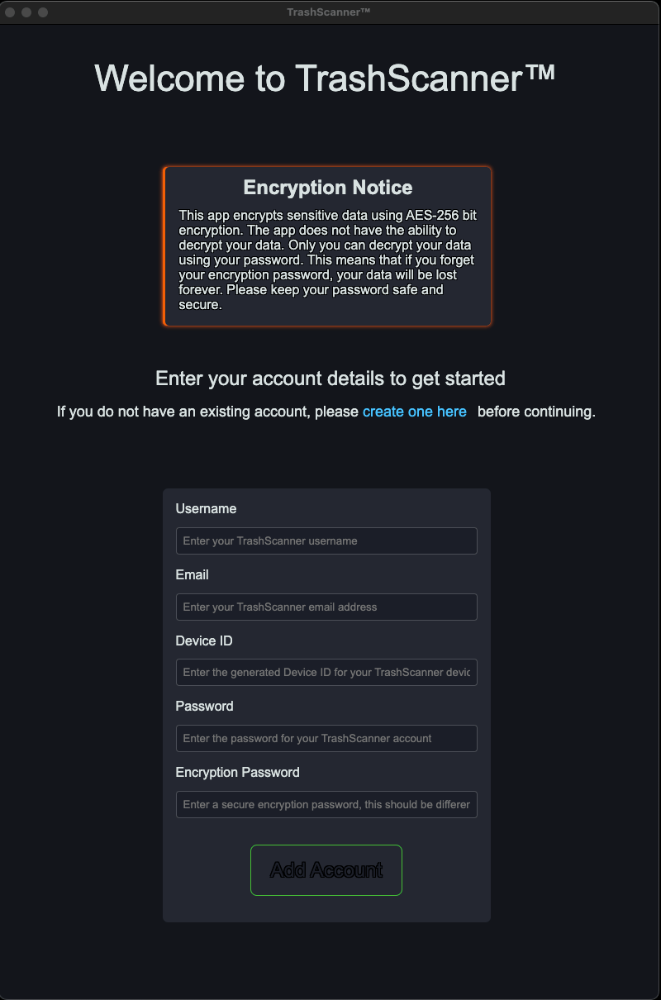
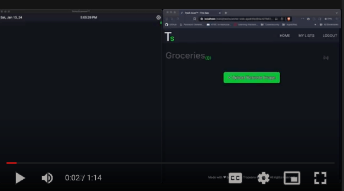

# TrashScan _The Device_&trade;

## Screenshot


## Description

TrashScan _The Device_&trade; is the smart barcode scanner that powers [TrashScan _The App&trade;_](https://github.com/iiTONELOC/trashscan-app). The Device, not only adds scanned barcodes to the user's default list, but it provides instant feedback regarding product information.

## Table of Contents

- [TrashScan *The Device*™](#trashscan-the-device)
  - [Screenshot](#screenshot)
  - [Description](#description)
  - [Table of Contents](#table-of-contents)
  - [Installation](#installation)
  - [Usage](#usage)
    - [Sign In](#sign-in)
    - [Scan Items](#scan-items)
  - [Demo](#demo)
  - [Tech Stack](#tech-stack)
  - [Contact](#contact)
  - [LICENSE](#license)

## Installation

```bash
git clone https://github.com/iiTONELOC/trashscan-device.git
```

Then install the dependencies and compile the application for your system:

```bash
npm i && npm run make
```

The generated output will be available in the `./out/make/` directory.

## Usage

### Sign In

A valid account for Trash Scanner&trade; and a valid device ID are required to complete a successful sign-in.

The application also protects data that is stored on the device using AES-256-bit encryption. First-time users will be informed
upon opening the application. The encryption key is provided by you, the user, and it is not stored anywhere. Therefore, if you forget your encryption key, you will not be able to access the encrypted data.

> NOTE: This project was created for a family member, and the ability to create device IDs from the App/Website has not yet been implemented in the UI. If you wish to try this out on your own, with your own components, and need to be able to generate a device ID, please reach out to me @ [anthonytropeano@protonmail.com](mailto:anthonytropeano@protonmail.com) and I will be happy to provide the functionality.



### Scan Items

A well-disguised HTML input element is auto-focused and waits for barcode input. The scanner mimics an HID device and rapidly sends keys. A user cannot type fast enough to type the barcodes in manually, a scanner must be used.

In the event a user changes focus by tapping elsewhere on the screen, you can ensure input will be captured by clicking just below the lighter-colored top bar where the date and time are located. If you click in the right area, the mouse will change from a regular cursor to a hand with an extended pointer finger.

Check out the demo below for a side-by-side view of scanning the items using the device, having the information displayed to the user for immediate feedback, and the data being available in the [TrashScan _The App&trade;_](https://github.com/iiTONELOC/trashscan-app).

The items will appear in the user's default list. If a default list does not exist, one titled _Default_ will be created automatically.

## Demo

[](https://drive.google.com/file/d/1ziXeSa1Nub1O0t2iqD4VylADp-xsuz8o/view?usp=sharing)

## Tech Stack

| Technology     | Description                                                       | Links                                           |
| -------------- | ----------------------------------------------------------------- | ----------------------------------------------- |
| Node           | JavaScript runtime environment                                    | [Node.js](https://nodejs.org/en/about)          |
| TypeScript     | JavaScript with syntax for types                                  | [TypeScript](https://www.typescriptlang.org/)   |
| Electron       | Build Cross-Platform Desktop Apps using Web Technologies          | [Electron.js](https://www.electronjs.org/)      |
| Electron Forge | All-in-One Tool for Packaging and Distributing Electron Apps      | [Electron Forge](https://www.electronforge.io/) |
| Preact         | 3kB replacement for React.js with the same API                    | [PREACT](https://preactjs.com/)                 |
| Vite           | Front-end tooling and dev environment, replacing Create React App | [Vite](https://vitejs.dev/)                     |

## Contact

If you have any questions or would like to get in touch please feel free to email me @ [anthonytropeano@protonmail.com](mailto:anthonytropeano@protonmail.com).

## LICENSE

This project is licensed by the MIT License [a copy can be viewed here](./LICENSE)
